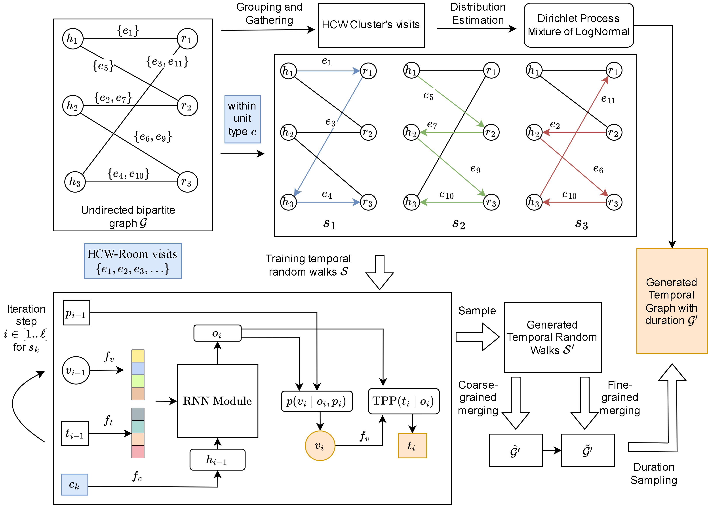

Official code for "TempoBiGen: A Curated Generative Model for Healthcare Mobility Logs with Visit Duration"

# Model Overview



# Setup environment
```bash
conda create -n tbg python=3.9 pip
conda activate tbg
# Install PyTorch and dependencies
pip install torch==2.3.1 torchvision==0.18.1

export TORCH=2.3.1
export CUDA=cu118 
pip install torch_scatter==2.1.2 torch_sparse==0.6.18 torch_cluster==1.6.3 torch_spline_conv==1.2.2 -f https://data.pyg.org/whl/torch-${TORCH}+${CUDA}.html
pip install -r requirements.txt
```

# Data Preparation
- Create your own data directory `DATA/processed_data/<dataset_name>` which contains:
    - `all_unittypes_refined.csv`: The processed data file containing mobility logs with following columns
        - `u`: HCW ID (from 1 to number of HCWs)
        - `i`: Room ID (from number of HCWs + 1 to number of HCWs + number of rooms)
        - `t`: Timestamp of the visit
        - `d`: Duration of the visit
        - `label`: Unit type of the room
    - `all_unittypes_refined_inv_map.pkl`: contain python dictionary with key `u` and `i`, which are the inverse mappings from HCW ID to their actual ID (for testing and visualization purposes).
- We provide a sample dataset in `DATA/processed_data/shift2.0_10` which you can use to test the code.

# Train
```bash

# Train TIGGER 
cd TIGGER
bash run_commands/run_shift2.sh

# Train TempoBiGen
cd TBG
bash TBG/run_commands/run_shift2_TBG_adapt.sh

# Evaluation on Attack rate of Disease simulation
 python episim_eval.py \
    --opath 'DATA/processed_data/shift2.0_10/all_unittypes_refined.csv' \
    --bpaths "TBG/results/shift2.0_10/postpro_best_adaptive/sampled_graph_0.csv" \
             "TBG/results/shift2.0_10/postpro_simple_adaptive/sampled_graph_0.csv" \
             "TBG/results/shift2.0_10/postpro_best_snapshot/sampled_graph_0.csv" \
             "TBG/results/shift2.0_10/postpro_simple_snapshot/sampled_graph_0.csv" \
    --bnames 'TBG_adapt' 'TBG_unif_adapt' 'TBG_snap' 'TBG_unif_snap' \
    --save_dir "shift_eval_plots_shift2.0_10"

# Evaluation on shift statistics
python shift_eval.py \
    --opath 'DATA/processed_data/shift2.0_10/all_unittypes_refined.csv' \
    --bpaths "TBG/results/shift2.0_10/postpro_best_adaptive/sampled_graph_0.csv" \
             "TBG/results/shift2.0_10/postpro_simple_adaptive/sampled_graph_0.csv" \
             "TBG/results/shift2.0_10/postpro_best_snapshot/sampled_graph_0.csv" \
             "TBG/results/shift2.0_10/postpro_simple_snapshot/sampled_graph_0.csv" \
    --bnames 'TBG_adapt' 'TBG_unif_adapt' 'TBG_snap' 'TBG_unif_snap' \
    --data_dir 'DATA/processed_data/shift2.0_10' \
    --hid_to_jtid_path 'DATA/hid_to_jtid_mapping.json' \
    --save_dir "shift_eval_plots_shift2.0_10"

```


# Acknowledgements
This code is adapted from the Tigger library you can find at https://github.com/data-iitd/tigger. 